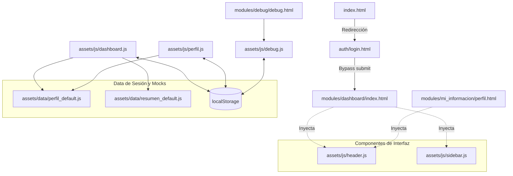

# Documentación Técnica — Réplica SUM-UNMSM

## 1. Resumen General
- **Propósito del proyecto**: Este sistema es una réplica local e interactiva del Sistema Único de Matrícula (SUM) de la Universidad Nacional Mayor de San Marcos (UNMSM). Su objetivo principal es la investigación, demostración y aprendizaje, replicando la experiencia de usuario y el diseño sin acceder a información real de la universidad.
- **Stack tecnológico detectado**: Vanilla HTML5, CSS3, y JavaScript (ES6+). Utiliza utilidades y librerías externas de frontend como Bootstrap 4, FontAwesome 5 (localizado), ApexCharts (para gráficos) y jsPDF (para generación de PDFs en cliente). No posee un bundler (como Webpack o Vite) ni servidor backend o Node.js.
- **Diferencias respecto al SUM-UNMSM real**: Funciona completamente offline. En lugar de comunicarse con un servidor o base de datos, utiliza objetos JSON locales inyectados en el contexto `window` (archivos `_default.js`) y `localStorage` para simular la persistencia y la respuesta a los formularios de la plataforma. La autenticación es totalmente simulada.

## 2. Estructura de Directorios
La estructura del proyecto es plana y basada en componentes modulares estáticos:

- `auth/`: Contiene `login.html`, la pantalla de inicio de sesión inicial.
- `assets/`: Todos los recursos estáticos del sistema.
  - `css/`: Hojas de estilos compartidas (`bootstrap.min.css`, `style.css`, `main-pro.css`) y específicas de vistas (`inicio.css`, `perfil.css`, etc.).
  - `data/`: Archivos `.js` críticos que alimentan la simulación. Aquí se definen todos los objetos JSON mock en variables globales como `PERFIL_DEFAULT_DATA`.
  - `images/`: Archivos gráficos e imágenes base quemadas (logos de la UNMSM, foto default de alumno).
  - `js/`: Lógica central del sistema. Aquí viven los scripts modulares por vista (ej. `perfil.js`, `matricula_inter.js`) y librerías (`lib/`).
  - `webfonts/`: Archivos tipográficos (e.g., FontAwesome offline).
- `modules/`: Contiene los archivos HTML separados lógicamente por dominio o funcionalidad:
  - `dashboard/`: Página principal post-login.
  - `mi_informacion/`: Perfil de usuario, historial académico y fichas socioeconómicas.
  - `matricula/`: Procesos de simulación de matrícula online.
  - `reportes/`: Vistas y reportes en pantalla.
  - `asistencia/`, `tutorias/`, `plan_estudios/`: Otros módulos complementarios.
  - `debug/`: Página administrativa oculta para modificar los datos locales (localStorage) y alterar el estado del sistema.

## 3. Punto de Entrada y Flujo de Arranque
- **Punto de Entrada**: El archivo raíz del proyecto es `index.html`, el cual está configurado únicamente con una etiqueta meta para realizar una redirección forzada e inmediata al inicio de sesión: `<meta http-equiv="refresh" content="0; url=auth/login.html" />`.
- **Orden de Inicialización y Flujo**:
  1. El usuario aterriza en `auth/login.html`.
  2. Tras hacer clic en el botón de login, el formulario realiza una redirección estática a `../modules/dashboard/index.html`.
  3. En cada vista (como `dashboard`), los archivos de datos (ej. `perfil_default.js`) se cargan mediante etiquetas `<script>`.
  4. Los scripts `header.js` y `sidebar.js` se ejecutan al evento `DOMContentLoaded` e inyectan el layout de navegación general. Disparan eventos personalizados `headerLoaded` y `sidebarLoaded`.
  5. El script específico de la página (ej. `dashboard.js`) escucha esos eventos y procede a vincular la UI (botones, timers) e hidratar la página con la data guardada en `localStorage` o en su defecto, en los objetos `window.*`.
- **Configuración de rutas (routing)**: No es una SPA. Todo el enrutamiento se maneja mediante enlaces directos a archivos físicos (`<a href="../modulo/pagina.html">`).

## 4. Mapa de Rutas / Páginas
| Ruta Física (Archivo HTML) | Archivo JS Principal | Descripción funcional |
|----------------------------|----------------------|-----------------------|
| `/index.html` | Ninguno | Redirección inmediata al login |
| `/auth/login.html` | Ninguno | Pantalla de inicio de sesión falsa |
| `/modules/dashboard/index.html`| `dashboard.js` | Menú interactivo y resumen inicial del alumno |
| `/modules/mi_informacion/perfil.html` | `perfil.js` | Vista detallada de datos personales y académicos |
| `/modules/mi_informacion/historial.html`| `historial.js` | Visualización del desempeño y cursos anteriores |
| `/modules/mi_informacion/ficha_soc.html`| `ficha_soc.js` | Formulario extenso de registro socioeconómico |
| `/modules/matricula/matricula_inter.html`| `matricula_inter.js` | Proceso interactivo (paso a paso) de la matrícula |
| `/modules/matricula/prog_asig.html` | `prog_asig.js` | Consulta de cursos, turnos y docentes programados |
| `/modules/reportes/rep_premat.html` | `rep_premat.js` | Resumen tabular de la pre-matrícula |
| `/modules/reportes/rep_matricula.html` | `rep_matricula.js`| Resumen (y PDF) de la matrícula concretada |
| `/modules/reportes/rep_eva.html` | `rep_eva.js` | Detalle de las evaluaciones y promedios |
| `/modules/reportes/rep_deuda.html` | `rep_deuda.js` | Listado de deudas (conceptos y estado de pago) |
| `/modules/asistencia/asistencia.html` | `asistencia.js` | Pantalla de asistencias |
| `/modules/tutorias/tutorias.html` | `tutorias.js` | Pantalla de tutorías |
| `/modules/plan_estudios/plan_estudios.html`| `plan_estudios.js`| Mallas curriculares |
| `/modules/debug/debug.html`| `debug.js` | Interfaz JSON para editar variables de localStorage |

## 5. Inventario de Componentes
Aunque el sistema no usa frameworks reactivos, abstrae componentes de UI a nivel de inserción DOM:

- **Componente `header.js`**:
  - **Ubicación**: `assets/js/header.js`
  - **Funcionalidad**: Inserta un template string estático que contiene la barra superior, el logo, opciones de usuario y contenedor del timer.
  - **Hijos que renderiza**: Barra lateral, contenedor del nombre de usuario.
  - **Dependencias padre**: Se anida antes del `.content` en todas las páginas.
- **Componente `sidebar.js`**:
  - **Ubicación**: `assets/js/sidebar.js`
  - **Funcionalidad**: Renderiza toda la barra lateral de navegación con submenús. Emite el evento `sidebarLoaded`.
  - **Hijos que renderiza**: Acordeones de los módulos.
- **Lógica UI en `dashboard.js`**:
  - **Ubicación**: `assets/js/dashboard.js`
  - **Funcionalidad**: Contiene las subrutinas de UI globales. Escucha el toggle del sidebar, la apertura de dropdowns del header, y crea y manipula un temporizador falso en cuenta regresiva de 15 minutos (si se cumple, redirige al login).
  - **Estado interno**: Variable `totalSeconds` simulando inactividad de sesión.

## 6. Datos Simulados (Mocks / "Default")
El motor de la app depende de esta estructura:

- **Perfil** (`assets/data/perfil_default.js`):
  - Expone `window.PERFIL_DEFAULT_DATA`.
  - Campos: JSON anidado (`datos_personales`, `contacto`, `academico`, `dependenciaEconomica`, etc.).
  - Consumo: Lo leen `dashboard.js`, `perfil.js`.
- **Resumen Dashboard** (`assets/data/resumen_default.js`):
  - Expone `window.RESUMEN_DEFAULT_DATA`.
  - Campos: Facultad, escuela, código, promedio general, etc.
- **Historial Académico** (`assets/data/historial_default.js`):
  - Arreglo de objetos simulando semestres cursados, asignaturas, nota final y créditos.
- **Programación de Cursos** (`assets/data/programacion_default.js`):
  - Define toda la oferta académica. Usado por la pantalla de matrícula para desplegar qué se puede escoger.
- **Imágenes** (`assets/data/foto_default.js`, `logos_base64.js`):
  - Strings en Base64 para evitar cargar rutas de assets problemáticos, garantizando que todo se lea puramente desde memoria si es necesario.

## 7. Autenticación / Sesión Simulada
- **Mecanismo**: Inexistente a nivel de seguridad. Al dar click en "Iniciar Sesión" en `login.html`, se anula el formulario (`event.preventDefault()`) y se lanza la instrucción pura: `window.location.href='../modules/dashboard/index.html'`. No se validan credenciales (cualquier usuario/contraseña funciona).
- **Almacenamiento**: La persistencia de datos (como editar el nombre o realizar una matrícula simulada) se basa 100% en `localStorage`. Por ejemplo, la matrícula final se marca con la llave `sum_matricula_realizada`.
- **Roles**: Únicamente el perfil del estudiante está mockeado.

## 8. Funcionalidades del Sistema
- **Consulta de Perfil (`perfil.js`)**: Lee el JSON del perfil o su equivalente en localStorage y manipula el DOM con `querySelector` para inyectar cada campo de texto (nombre, colegio, tipo de ingreso, aptitudes). Fidelidad muy alta a la interfaz real de SUM.
- **Ficha Socioeconómica (`ficha_soc.js` y `formulario_blocks/*`)**: Permite un asistente multi-paso extenso.
- **Simulación de Matrícula (`matricula_inter.js`)**: Permite al estudiante añadir o quitar cursos basándose en `programacion_default.js`. Si completa el proceso, inyecta `sum_matricula_realizada` en el navegador, desactivando la capacidad de re-matricularse y habilitando la vista del reporte.
- **Reportes (`rep_matricula.js`, `rep_eva.js`)**: Carga los datos generados o pre-definidos y los expone en pantalla en formato tabla, a veces usando dependencias para generar un archivo PDF emulando los comprobantes del SUM oficial.
- **Panel de Debug (`debug.js`)**: Proporciona un `textarea` visual en la ruta `/debug` que permite a desarrolladores modificar las estructuras JSON alojadas en `localStorage` o reiniciarlas de fábrica. Adicionalmente, posee un botón especial para "Borrar matrícula" y probar flujos nuevamente sin borrar caché global.

## 9. Relación entre Archivos (Grafo de Dependencias)

**Explicación:** La navegación central inicia con index.html que delega al login, quien abre la puerta a todos los demás HTML (representados por `dashboard`). Todas estas páginas consumen e inyectan automáticamente el sidebar y header para unificar visualmente el sitio. Los archivos JS de lógica (`dashboard.js`, `perfil.js`) actúan de puentes consultando a las variables en los archivos de datos (`_default.js`), pero antes validan si `localStorage` posee datos personalizados creados a través de las interacciones o el módulo de Debug.

## 10. Estilos y Recursos Estáticos
- **CSS**: Todo el estilo propio se encuentra en `assets/css`. El estilo base es un template predefinido adaptado que depende principalmente de `bootstrap.min.css`. La arquitectura no preprocesa CSS (no hay SASS/SCSS explícito ni TailwindCSS). Las reglas de responsive design e interacciones flotantes del menú están incrustadas parcialmente en la lógica JS o CSS (`main-pro.css`, `style.css`).
- **Fuentes e Imágenes**: Todo se carga de forma local desde `assets/images` y `assets/webfonts`, haciendo a la aplicación 100% independiente de CDN externos. 

## 11. Configuración y Scripts
No aplica. Al ser una réplica en HTML puro sin ecosistema Node.js (se abre directamente haciendo doble clic en el `index.html` o levantando un servidor HTTP simple tipo Live Server), no existe el archivo `package.json`, variables `.env` o procesos de despliegue.

## 12. Observaciones, Inconsistencias y Código no Utilizado
- **Timer inconsistente**: El temporizador de 15 minutos se inyecta en el `header.js` y cobra vida por código dentro de `dashboard.js`. No existe una sesión persistente de tiempo, por lo que navegar a otra página y regresar reiniciará los 15 minutos en el contador.
- **Ausencia de estado global en memoria**: Al no existir un framework (como React o Vue) ni una API local, el único "estado" real es la mutación del `localStorage`. Si el usuario desactiva `localStorage`, la app entra en un modo estrictamente de solo-lectura sobre los datos `default`.

## 13. Glosario de Términos del Dominio (SUM-UNMSM)
- **SUM**: Sistema Único de Matrícula (portal oficial centralizado del estudiante en UNMSM).
- **Ficha Socioeconómica**: Conjunto de encuestas requeridas periódicamente sobre ingresos, vivienda y contexto del alumno.
- **Pre-Matrícula**: Proceso previo para sondear demanda de cursos y vacantes antes de la matrícula oficial.
- **Plan de Estudios**: Malla curricular oficial que dicta los pre-requisitos y créditos necesarios para egresar de una carrera o escuela particular de la UNMSM.
